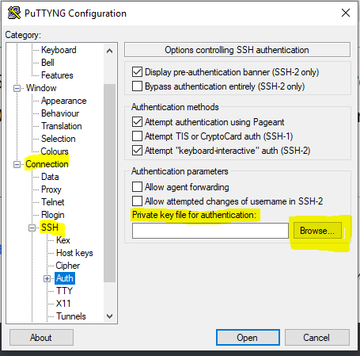
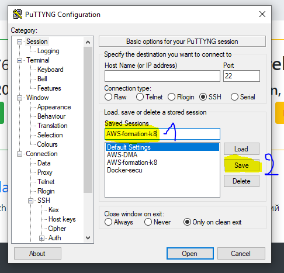
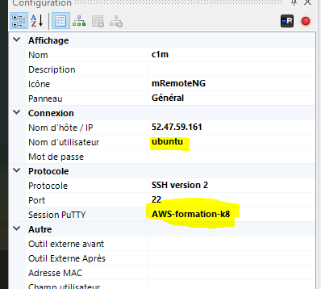

# install K8s on AWS IaaS with kubeadm

## se connecter en ssh sur chaque vm (master, worker 1 et worker 2)

client ssh https://mremoteng.org/download (choisir le zip)

https://mremoteng.org/download

Lancer Puttyng qui se trouve dans le répertoire téléchargée


séléctionner le fichier ./key/formation-k8-key.ppk
sauvegarder la configuration putty


config mRemoteNG


## git clone sur les 3 VM

```
git clone https://github.com/david-maumenee/formation-k8s.git
```


## install pre requis SUR LES 3 VM (en //)

```sh

# !!!!!!!! change dir !!!!!!!!!!
cd ./formation-k8s/02-Install/install-iaas-aws/provision/

# make script executable
chmod a+x *.sh

# check script
more setup.sh

# run script 
./setup.sh

# test Docker (provoque une erreur "normal" car l'ajout du user ubuntu dans le group docker n'est pas prise en compte en live)
docker info

# se déconnecter et reconnecter
docker info
kubeadm version

```


## init du cluster sur le master

Connect with ssh on the **master**


```sh
# set public IP
export PUBLIC_IP=XX.XX.XX.XX

# pre-pull images
sudo kubeadm config images pull

# init the cluster
sudo kubeadm init --apiserver-cert-extra-sans=$PUBLIC_IP --pod-network-cidr=10.244.0.0/16
```

Copy paste the printed instruction after  : Your Kubernetes control-plane has initialized successfully!

```
To start using your cluster, you need to run the following as a regular user:

  mkdir -p $HOME/.kube
  sudo cp -i /etc/kubernetes/admin.conf $HOME/.kube/config
  sudo chown $(id -u):$(id -g) $HOME/.kube/config

You should now deploy a pod network to the cluster.
Run "kubectl apply -f [podnetwork].yaml" with one of the options listed at:
  https://kubernetes.io/docs/concepts/cluster-administration/addons/

Then you can join any number of worker nodes by running the following on each as root:

kubeadm join XX.XX.XX.XX:6443 --token uwv552.TTTTTTT \
    --discovery-token-ca-cert-hash sha256:YYYYYYYYYYYY
```

complete the config

```sh
  mkdir -p $HOME/.kube
  sudo cp -i /etc/kubernetes/admin.conf $HOME/.kube/config
  sudo chown $(id -u):$(id -g) $HOME/.kube/config

# auto completion and alias
echo "source <(kubectl completion bash)" >> ~/.bashrc
echo "alias k=kubectl" >> ~/.bashrc
echo "complete -F __start_kubectl k" >> ~/.bashrc
source ~/.bashrc

# check kubernetes item (coredns pod pending)
kubectl get all --all-namespaces

# install CALICO pod network"
kubectl apply -f https://docs.projectcalico.org/v3.3/getting-started/kubernetes/installation/hosted/canal/rbac.yaml
kubectl apply -f https://docs.projectcalico.org/v3.3/getting-started/kubernetes/installation/hosted/canal/canal.yaml

# re check kubernetes item (wait for canal and coredns running)
kubectl get pod --namespace kube-system
```

Pour retrouver les paramètres la commande kubeadm join (si vous les avez perdus...)

```
# prepare add node https://kubernetes.io/fr/docs/setup/independent/create-cluster-kubeadm/#join-nodes
echo "kubeadm token list :"
kubeadm token list

 # discovery-token-ca-cert-hash
echo "discovery-token-ca-cert-hash :"

openssl x509 -pubkey -in /etc/kubernetes/pki/ca.crt | openssl rsa -pubin -outform der 2>/dev/null | \
   openssl dgst -sha256 -hex | sed 's/^.* //'
```
## pour interagir avec le cluster depuis votre PC

- copier le contenu du fichier ~/.kube/config (avec la commande ```cat``` et non ```more``` car ajouter des sauts de lignes) dans un fichier sur votre pc (par exemple my-config.conf).
- **REMPLACER** l'IP (privée) par l'IP public de votre master
- installer kubectl sur votre pc
- lancer un shell
- se positionner dans le répertoire du fichier
- initialiser une variable d'environnement qui pointe sur le fichier exemple sous windows ```set KUBECONFIG=%cd%\my-config.conf```
- kubectl get nodes

## init des workers (sur les 2 VMs)

Utiliser la commande kubeadm join affichée lors de l'init en ajoutant **sudo** devant sinon

error execution phase preflight: [preflight] Some fatal errors occurred:
        [ERROR IsPrivilegedUser]: user is not running as root

sudo kubeadm join ...

